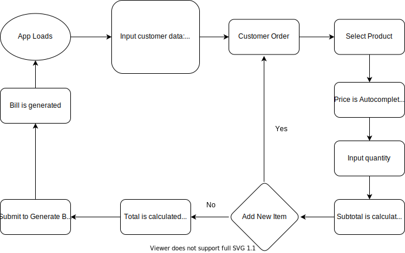

# Bill Generator App
A web app designed to generate bills in a easy way.

## Built with

* HTML
* CSS
* JavaScript (Vanilla)
* Stylus

## App Demo

Deployed at: https://bill-generator-nine.vercel.app/

## Screenshot


## How it works

* Load generate bills page
* Fill all Customer data required
* Select a product from the product list
* Price input is filled automatically
* Input the quantity value 
* Subtotal calculation is made from multiplying price by quantity
* If you want add more items, press "Add More Items" button
* Total is displayed at the end of the page
* Press "Generate Bill" button to generate a bill 



## Clone project

This project can be cloned from the following repository:

```bash
  git clone https://github.com/davidevOS/bill-generator.git
```

*No need to install dependencies. Just open the index.html file in your browser.

## Developed By: 

[David Galeano](https://github.com/davidevOS) 
